# Strichzeichnung-vektorisieren

Deutschsprachige Anleitung zur Digitalisierung und Vektorisierung von Strichzeichnungen.

- Zeichnung auf einem weißen Blatt Papier mit Bleispift anfertigen
- Linien mit einem schwarzen Stift (z.B. Fineliner) nachziehen
- Zeichnung bildfüllend fotografieren
    - Zeichnung sollte einigermaßen gleichmäßig ausgeleuchtet sein (Schatten vermeiden)
    - Bild sollte scharf sein, ggf. Fotoapperat durch Bücherstapen stabilisieren
- Bild mit Gimp öffnen
- Bild drehen und beschneiden
- Rechtsklick -> Bild -> Modus -> Graustufen
- Reinzomen um zu ermitteln wie breit eine Strich ungefähr in Pixel ist (z. B. 18px)
- Rechtsklick -> Filter -> Kanten finden -> Differenz der Normalverteilung
    - Radius 1 auf das doppelte der Strichbreite (z. B. 36px)
    - Radius 2 auf die Strichbreite (z. B. 18px)
    - Normalisieren und invertieren anhacken
- Rechtsklick -> Farben -> Schwellwert
    - Automatisch, ggf. Linienstärke durch anpassen der unteren Grenze einstellen
- Rechtsklick -> Bild -> Modus -> Indiziert
    - Schwarz/Weiß-Palette
- ggf. mit Radiergummi kleine Unschönheiten manuell korrigieren
    - Tipp: Vorder und Hintergrundfarde können über den kleinen Pfeil getauscht werden
- Datei -> Exportieren als -> als PNG Datei speichern -> Exportieren
    - die PNG Export-Einstellungen sind egal

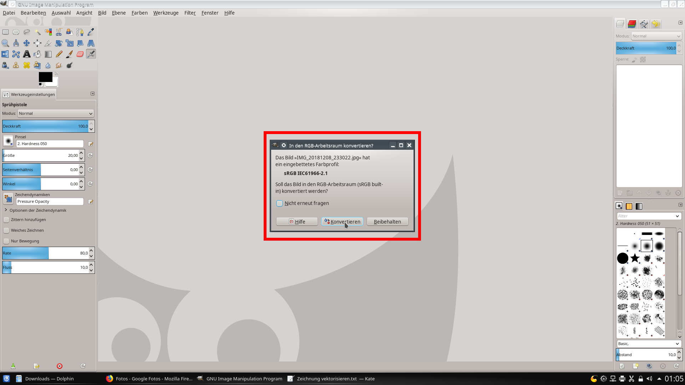

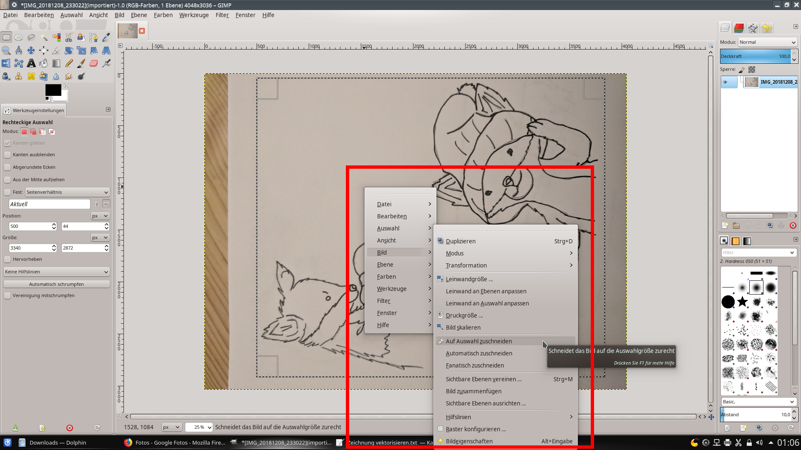

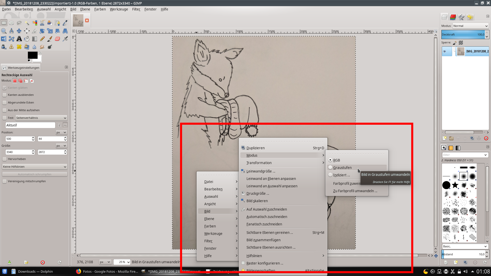

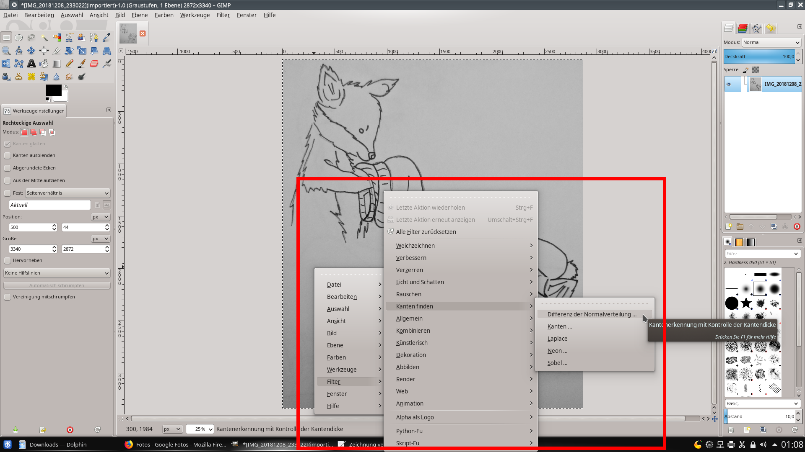
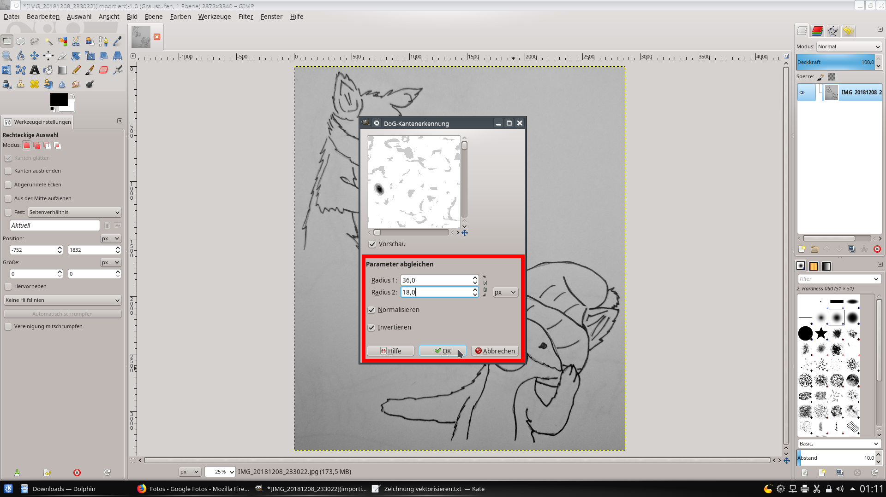
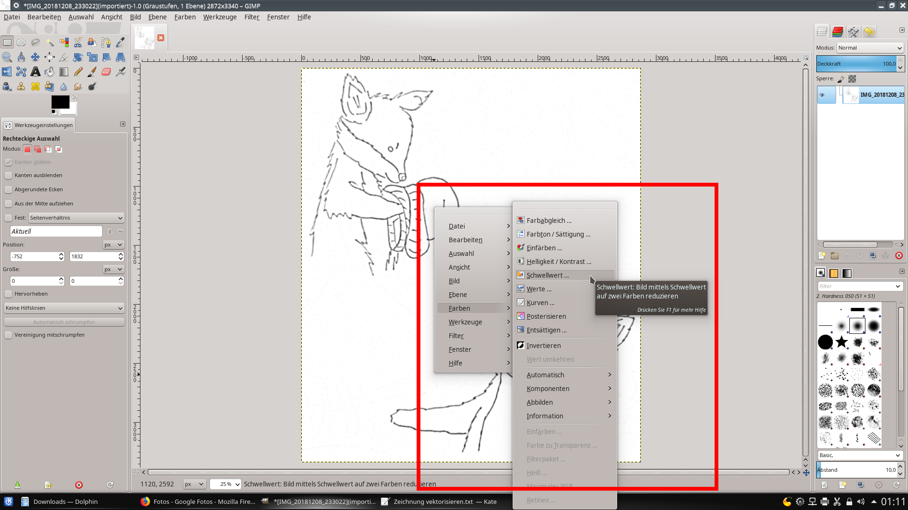
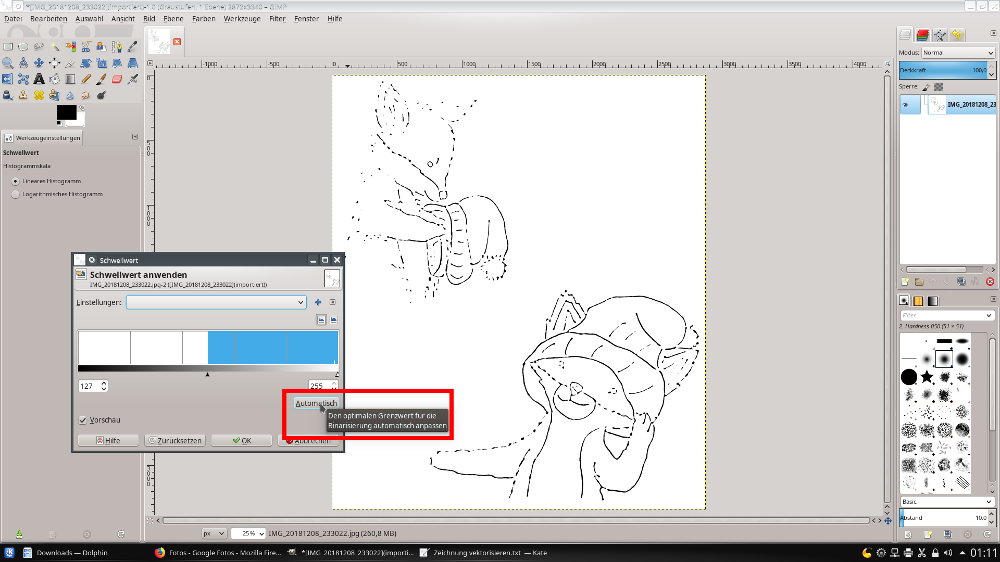
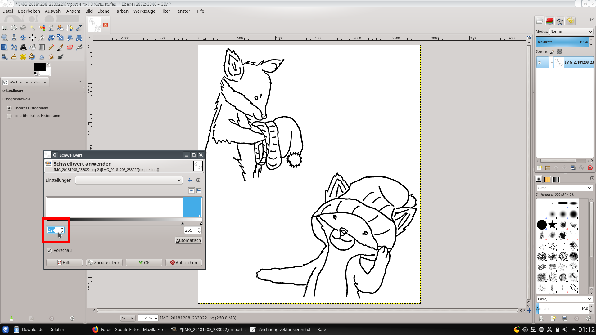

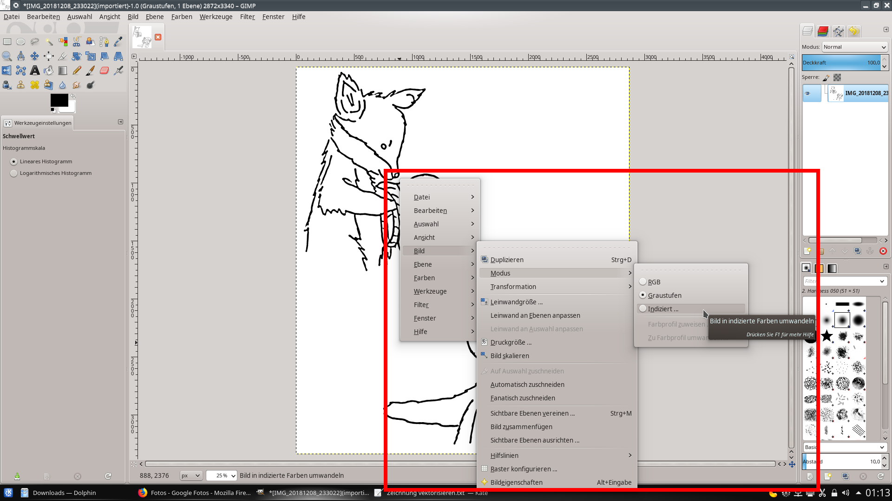
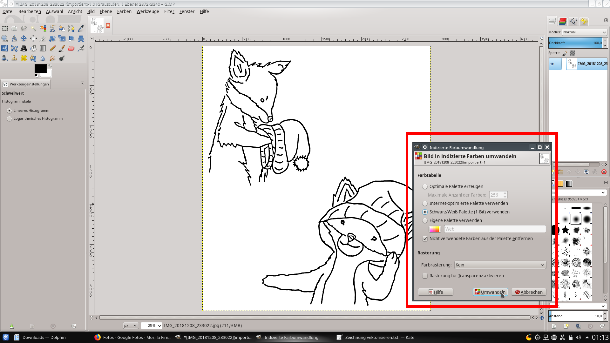

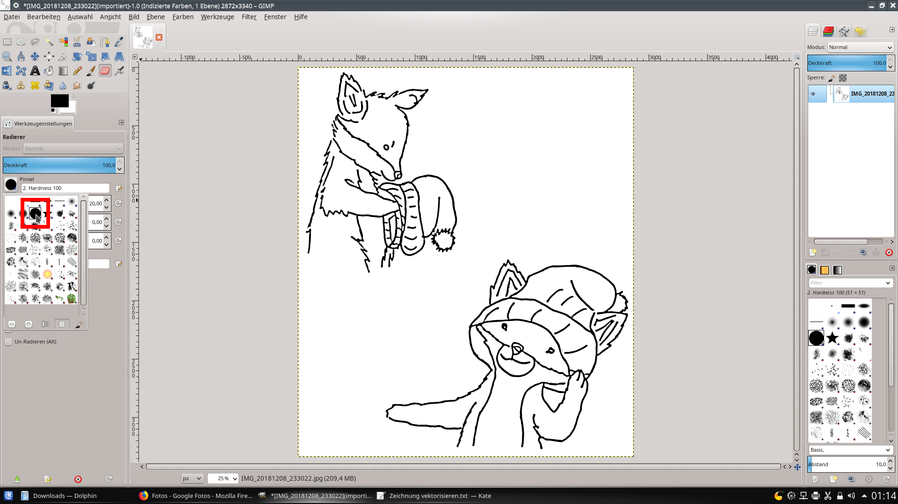

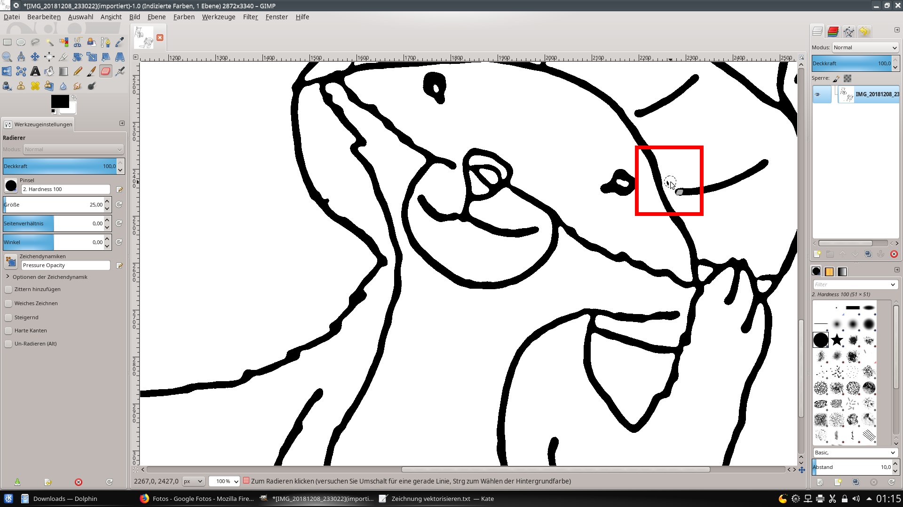
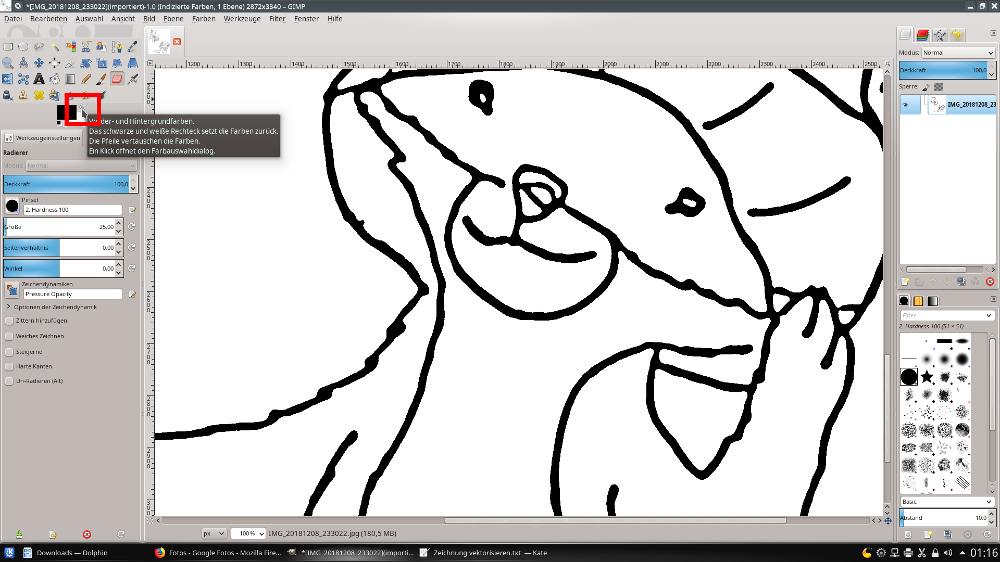

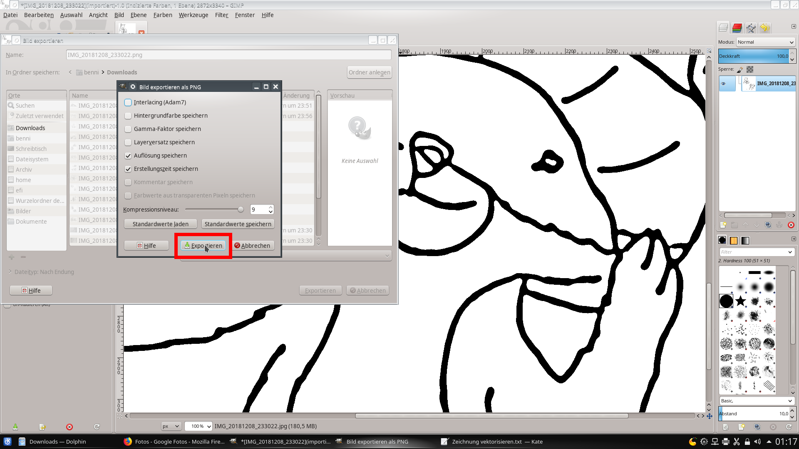
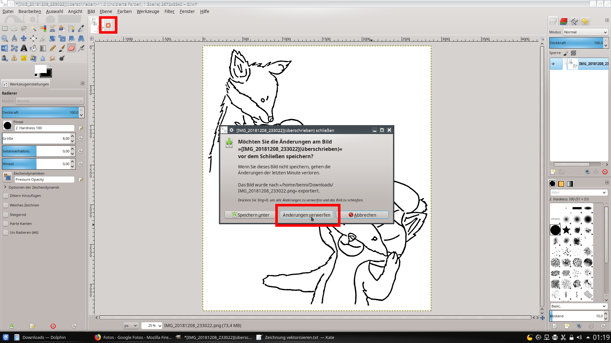
